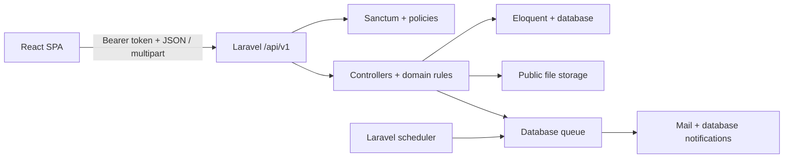

<div align="center">

<h1>🧹 CleanHub API</h1>

<h3>The backend for a cleaning-work marketplace where opportunity, trust, and accountability meet.</h3>

<p><strong>Laravel 13 · REST API · Sanctum · Eloquent · Queues · Pest</strong></p>

<p><a href="https://github.com/murhee-ia/cleanhub-react">Frontend repository</a> · <a href="docs/api.md">API manual</a> · <a href="docs/architecture.md">Architecture guide</a> · <a href="docs/testing.md">Testing guide</a></p>

</div>

---

## Table of contents


- [Meet CleanHub](#meet-cleanhub)
- [What this repository does](#what-this-repository-does)
- [Who CleanHub serves](#who-cleanhub-serves)
- [How work moves through CleanHub](#how-work-moves-through-cleanhub)
- [Current capabilities](#current-capabilities)
- [Rules that shape the platform](#rules-that-shape-the-platform)
- [Backend stack](#backend-stack)
- [How the backend is arranged](#how-the-backend-is-arranged)
- [Run it locally](#run-it-locally)
- [Demo accounts and data](#demo-accounts-and-data)
- [Useful development commands](#useful-development-commands)
- [Documentation library](#documentation-library)
  - [API manual](docs/api.md)
  - [Architecture guide](docs/architecture.md)
  - [Testing and verification guide](docs/testing.md)
- [Companion frontend](#companion-frontend)
- [Portfolio disclaimer](#portfolio-disclaimer)

## Meet CleanHub


Every home, hotel, hospital, office, and public space depends on cleaning work,
yet the people offering and looking for that work are often left to navigate
generic listings and disconnected conversations. CleanHub gives that process a
place of its own.

It is a role-based recruitment platform where cleaners can turn experience into
a visible professional profile, discover relevant opportunities, and follow
each application from interest to completed work. Employers can move from an
idea—“this space needs a cleaner”—to a published listing, an organized applicant
pool, and a completed working relationship without losing context along the
way.

That focus makes the platform useful across very different environments:
residential homes, hotels, hospitals, offices, factories, research facilities,
public spaces, and event venues can share one workflow without pretending the
work itself is identical. Categories, profile details, schedules, documents,
and reputation signals give each opportunity enough structure to be understood
before either party commits.

CleanHub stays intentionally on the recruitment side of that relationship.
Compensation may be displayed on a job post, but the platform does **not**
process payments, salaries, contracts, invoices, or payouts. Those arrangements
remain between the cleaner and employer outside the application.

CleanHub is split into two repositories:

| Repository | Responsibility |
|---|---|
| **`cleanhub-laravel`** — this repository | Versioned API, authentication, authorization, validation, domain rules, persistence, uploads, notifications, scheduled work, and tests |
| [`cleanhub-react`](https://github.com/murhee-ia/cleanhub-react) | Browser interface, role-aware routes, forms, data fetching, calendars, dashboards, and responsive presentation |

## What this repository does


The interface is where people experience CleanHub; this API is where the
platform keeps its promises. It makes sure a saved job stays saved, an accepted
application becomes calendar work, a rating belongs to a real completed
relationship, and a privileged action leaves an audit trail.

The React application can request an action, but this backend decides whether
the caller is allowed to perform it, validates the request, changes the correct
records, and returns a stable JSON representation. That separation gives future
clients—another web experience, a mobile app, or an integration—the same domain
rules instead of a second interpretation of CleanHub.



HTTP routes stay thin. Form Requests validate input, policies and gates enforce
access, controllers coordinate use cases, Eloquent models represent the domain,
and API Resources define the JSON sent back to clients. Developers get clear
boundaries; users get consistent behavior no matter which screen initiates the
request.

## Who CleanHub serves


CleanHub opens simply and becomes more capable as responsibility increases:

| Role | The experience CleanHub creates |
|---|---|
| **Guest** | A low-friction window into available cleaning work: browse, search, filter, sort, and inspect public jobs before deciding to join |
| **Cleaner** | A working hub for professional identity and opportunity: maintain a profile, upload documents, save jobs, apply, follow statuses, organize accepted work on a monthly calendar, complete jobs, build reputation, report concerns, and stay informed |
| **Employer** | A focused recruitment workspace: shape a draft, publish when ready, manage applicants per job, inspect cleaner context, keep private notes, make decisions, confirm completion, build reputation, report concerns, and receive applicant updates |
| **Moderator** | A bounded safety workspace: investigate the report queue, resolve or reject cases, hide reported jobs or ratings, warn responsible users, and escalate cases that need wider authority |
| **Admin** | A platform-wide operating view: understand headline activity; manage users, jobs, categories, moderators, settings, and audit history; and reverse supported moderation/management actions |

Public registration is limited to cleaners and employers. Moderator accounts are
created by the admin, and the application provisions exactly one admin account.

## How work moves through CleanHub


A CleanHub relationship begins with discovery, but it does not end at an apply
button. The platform preserves the story of the work from the first listing to
the reputation each party carries into the next opportunity:

```text
Guest discovers a published job
        ↓
Cleaner registers, verifies email, saves or applies
        ↓
Employer reviews that job's applicants and accepts or rejects
        ↓
Accepted application appears on the cleaner's calendar
        ↓
Cleaner completes the application ─┐
                                   ├─ each party may rate the other
Employer completes the job post ───┘
```

The two completion actions are independent by design. A cleaner uploads proof
to complete their application; an employer uploads proof to complete the job
post. One party cannot speak for the other by silently completing their record,
and each party's own completion unlocks their direction of the rating
relationship. That gives both sides agency while still building a shared,
verifiable history.

## Current capabilities


CleanHub already connects its central workflows end to end. These are not
isolated demonstrations: the same jobs, profiles, applications, and trust
signals move through discovery, hiring, completion, and oversight.

### Discovery and profiles

- Public, paginated job browsing turns the platform into an open window rather
  than a registration wall, with search, location/category/date filters, and
  sorting.
- Separate cleaner and employer profiles with role-specific fields, documents,
  visible-rating summaries, and work history counts help each side understand
  who is behind an application or listing.
- Admin-managed cleaning categories, initially seeded with eight categories,
  let the marketplace grow without hard-coding every future kind of cleaning
  work into the interface.

### Jobs, applications, and calendars

- Draft and published visibility lets an employer prepare carefully before a
  listing becomes discoverable, while job status tracks what happens after it
  goes live.
- Forward-only job lifecycle: `open → reviewing → closed → completed`, with
  moderator/admin removal represented separately.
- Cleaner saved jobs keep promising work close; durable application records
  provide permanent duplicate-application protection.
- Optional application messages and PDF resumes add job-specific context without
  replacing the cleaner's wider profile.
- Employer applicant lists scoped to a specific job, decision messages, and
  employer-only private notes keep simultaneous recruitment efforts organized.
- Schedule-conflict rejection when a cleaner applies for work overlapping an
  already accepted job helps prevent avoidable commitments.
- Calendar data derived directly from accepted/completed applications—there is
  no duplicate calendar table to fall out of sync.

### Completion, trust, and communication

- Required image/PDF proof gives cleaner-side and employer-side completion a
  concrete record.
- One 1–5 star rating per reviewer per application, with optional review text,
  turns completed work into portable trust for the next decision.
- Ratings derive the reviewee from the authenticated relationship; clients
  cannot choose an unrelated account.
- Reports against users, job posts, and ratings, with duplicate/self-report
  safeguards, give people a direct path when something does not look right.
- Reversible moderation actions and an audit trail for privileged changes make
  oversight accountable as well as powerful.
- Queued mail/database notifications for application and report events.
- Unread/read notification APIs and an idempotent next-day job reminder command.

## Rules that shape the platform


The most important parts of CleanHub are not just screens; they are guarantees
encoded into the domain. These constraints keep convenience from weakening
trust as the platform grows:

- **The backend is authoritative.** Frontend guards improve UX; policies and
  role middleware enforce access here.
- **Bearer-token authentication is stateless.** Sanctum tokens travel in the
  `Authorization` header; the React/API boundary does not use cookie-based SPA
  auth or a CSRF exchange.
- **One application means one durable relationship.** Applications change
  status rather than being deleted, preserving duplicate-application
  protection and history.
- **Acceptance drives the calendar.** Saving, applying, or completing does not
  create a separate calendar record.
- **Ratings require the reviewer's completion condition.** Cleaner→employer and
  employer→cleaner reviews are independent rows.
- **Privileged destructive actions are reversible where supported.** Users and
  job posts use recoverable states/soft deletion, and privileged mutations are
  audited.
- **Compensation is informational only.** There is no checkout, billing,
  payroll, or contract workflow.

## Backend stack


| Technology | Version in this repository | How CleanHub uses it |
|---|---:|---|
| **PHP** | `^8.3` | Runtime for the API and console commands |
| **Laravel** | `^13.17` | Routing, validation, dependency container, queues, notifications, scheduler, filesystem, mail, and testing foundation |
| **Laravel Sanctum** | `^4.3` | Personal access tokens for stateless bearer authentication |
| **Eloquent ORM** | Laravel 13 | Models, relationships, enum casts, query scopes, pagination, soft deletes, and aggregates |
| **MySQL / SQLite** | Configurable through `.env` | MySQL is the intended application database; the included local defaults and automated test suite use SQLite |
| **Laravel Filesystem** | Laravel 13 | Stores profile assets, job media, resumes, documents, and completion proofs on the public disk |
| **Laravel Notifications + Queues** | Laravel 13 | Sends application/report email and database notifications asynchronously through the database queue |
| **Laravel Scheduler** | Laravel 13 | Runs `app:send-job-reminders` daily at 08:00 |
| **Pest / PHPUnit** | Pest `^4.7`, PHPUnit 12 through Pest | Feature-heavy automated coverage for auth, profiles, jobs, applications, ratings, notifications, moderation, and administration |
| **Larastan / PHPStan** | `^3.9` | Static analysis of application code |
| **Laravel Pint** | `^1.27` | PHP formatting checks |
| **GitHub Actions** | Repository workflow | Installs the app, migrates the test database, and runs `composer test` for pull requests and pushes to `main` |

## How the backend is arranged


```text
app/
├── Console/Commands/       scheduled and manually invoked commands
├── Enums/                  fixed role and lifecycle values
├── Http/Controllers/Api/V1 versioned HTTP use cases
├── Http/Requests/          authorization-aware input validation
├── Http/Resources/         stable response shapes
├── Models/                 Eloquent domain model
├── Notifications/          queued application, auth, and report messages
├── Policies/               ownership and role authorization
└── Rules/                  reusable validation rules
database/
├── migrations/             schema history
├── factories/              test data builders
└── seeders/                admin, categories, and local demo data
routes/
├── api.php                 `/api/v1` endpoint map
└── console.php             scheduled reminder registration
tests/                      Pest unit and feature suites
docs/                       API, architecture, and testing manuals
```

For the reasoning behind these boundaries and the relationships between files,
read the [architecture guide](docs/architecture.md).

## Run it locally


### 1. Prerequisites

Install:

- Git
- PHP 8.3 or newer
- Composer 2
- Laravel's required PHP extensions, including PDO for your chosen database
- PHP GD if you want the local demo seeder to generate placeholder job images
- MySQL for the intended database setup, **or** SQLite for the quickest local
  start

The separate [React frontend](https://github.com/murhee-ia/cleanhub-react)
requires Node.js and npm.

### 2. Clone and install dependencies

```bash
git clone https://github.com/murhee-ia/cleanhub-laravel.git
cd cleanhub-laravel
composer install
```

### 3. Create the environment file

```bash
cp .env.example .env
php artisan key:generate
```

Set the application/frontend URLs and local identity values in `.env`:

```dotenv
APP_NAME=CleanHub
APP_URL=http://localhost:8000
FRONTEND_URL=http://localhost:5173

MAIL_MAILER=log
QUEUE_CONNECTION=database
```

`MAIL_MAILER=log` writes local verification/reset messages to
`storage/logs/laravel.log` instead of contacting an email provider.

Before seeding, replace the default admin password in `.env`:

```dotenv
ADMIN_NAME="CleanHub Admin"
ADMIN_EMAIL=admin@cleanhub.test
ADMIN_PASSWORD="choose-a-local-password"
```

Never commit `.env` or real credentials.

### 4. Configure a database

#### Option A — MySQL

Create an empty MySQL database, then update `.env`:

```dotenv
DB_CONNECTION=mysql
DB_HOST=127.0.0.1
DB_PORT=3306
DB_DATABASE=cleanhub
DB_USERNAME=root
DB_PASSWORD=
```

#### Option B — SQLite quick start

The included `.env.example` already selects SQLite. Create the ignored local
database file:

```bash
touch database/database.sqlite
```

### 5. Build the schema and seed local data

```bash
php artisan migrate --seed
php artisan storage:link
```

In non-production environments, `DatabaseSeeder` creates the single admin,
cleaning categories, demo cleaner/employer profiles, and demo job posts. The
seeders are idempotent, so rerunning `php artisan db:seed` does not intentionally
duplicate those records.

### 6. Start the API and background processes

Use separate terminals from `cleanhub-laravel/`:

```bash
# Terminal 1 — API at http://localhost:8000
php artisan serve
```

```bash
# Terminal 2 — queued mail/database notifications
php artisan queue:work
```

```bash
# Terminal 3 — local scheduler for the 08:00 reminder command
php artisan schedule:work
```

The API base URL is `http://localhost:8000/api/v1`. Start the React repository
with `VITE_API_URL=http://localhost:8000/api/v1` to use the complete application.

## Demo accounts and data


`php artisan migrate --seed` creates verified local accounts. Unless you changed
the seed configuration, the demo user password is `password`.

| Role | Example account |
|---|---|
| Cleaner | `cleaner1@demo.test` |
| Cleaner | `cleaner2@demo.test` |
| Cleaner | `cleaner3@demo.test` |
| Employer | `employer1@demo.test` |
| Employer | `employer2@demo.test` |
| Employer | `employer3@demo.test` |
| Admin | The `ADMIN_EMAIL` and `ADMIN_PASSWORD` values configured before seeding |

No moderator is seeded; the admin can create moderator accounts through the
administration interface/API. These accounts and job posts are development data
only.

## Useful development commands


| Command | Purpose |
|---|---|
| `php artisan route:list --path=api --except-vendor` | Inspect application API routes |
| `php artisan test` | Run the Pest/PHPUnit test suites |
| `composer lint:check` | Check PHP formatting without changing files |
| `vendor/bin/phpstan analyse --memory-limit=512M` | Run static analysis with a practical local memory allowance |
| `composer test` | Run config clearing, formatting checks, static analysis, and tests as one quality gate; PHPStan may need a higher local PHP memory limit |
| `php artisan app:send-job-reminders` | Manually enqueue next-day reminders; duplicate reminders are guarded |
| `php artisan queue:restart` | Ask long-running queue workers to restart cleanly after deployment/code changes |

See [testing.md](docs/testing.md) for focused suites, expected behavior, and
manual API verification examples.

## Documentation library


The README is the lobby. Pick the door that matches the question in front of
you:

### 📡 “What can the API say and accept?”

> Follow every endpoint from authentication to response shape. See payloads,
> statuses, validation failures, pagination, and the contracts the frontend
> relies on.
>
> **[Enter the API manual →](docs/api.md)**

### 🧭 “Where does this behavior actually live?”

> Walk a request through routes, Form Requests, policies, controllers, models,
> resources, storage, queues, and notifications—and learn why those boundaries
> were chosen.
>
> **[Explore the architecture →](docs/architecture.md)**

### 🧪 “How do I prove the rule still holds?”

> Find the automated suites, focused commands, test data patterns, and manual
> checks that turn business expectations into repeatable evidence.
>
> **[Open the testing field guide →](docs/testing.md)**

## Companion frontend


The browser application lives in
[`murhee-ia/cleanhub-react`](https://github.com/murhee-ia/cleanhub-react). Run
both repositories to experience role-based navigation, job discovery,
applications, calendars, notifications, moderation, and administration as a
complete system.

## Portfolio disclaimer


CleanHub is a **personal project created for learning, experimentation, and
portfolio presentation**. It demonstrates full-stack product design and
engineering decisions; it is not presented as a commercial employment agency
or production marketplace. Do not use the local/demo configuration for real
users or upload sensitive personal documents without completing an independent
production security, privacy, deployment, and legal review.
